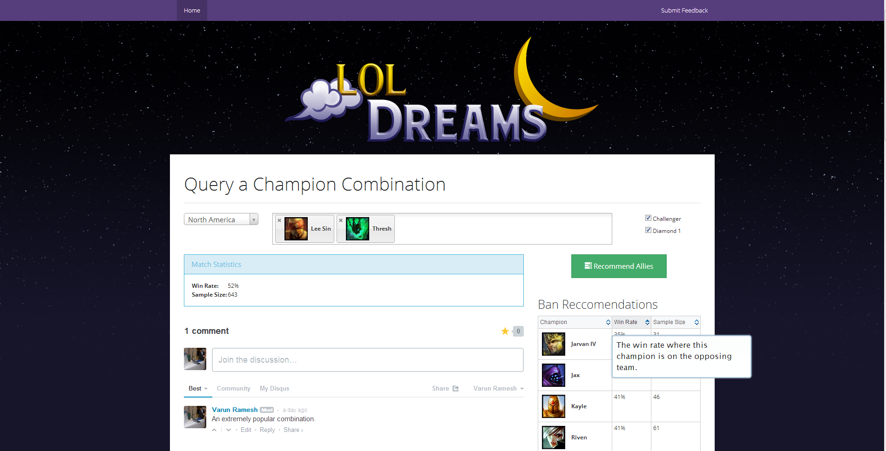

# LoL Dreams
## Champion combination analysis

LoL Dreams is a Django app that scrapes games from a given set of leagues, storing them in a database. Later, users can enter in a combination of champions, and the app will calculate the win rate of all games where those champions appeared on the same team.

### Ally Recommendations
Users can also get recommendations for Allies, where all champions are tested against the current team. The champions, that when added to the current team provide the highest win rate are displayed in a sorted table.

### Ban Recommendations
Ban Recommendations are also provided using a similar system. For every champion not included on the given team, the win rate is calculated from all games where that champion opposes your team.

### DISQUS Comments
DISQUS is used to let people comment on champion combinations (order of the champion comments does not matter).
